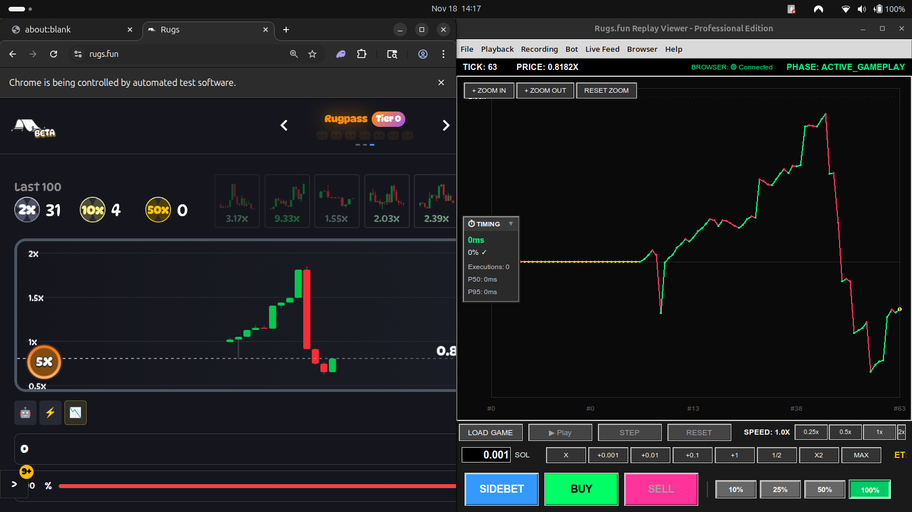

# Rugs.fun Replay Viewer - Professional Edition

## 🚀 Overview

A professional dual-mode replay/live trading platform for Rugs.fun with advanced bot automation, browser integration, and ML-powered decision making. Transform from research to production with seamless transition between replay training and live trading.



## ✨ Key Features

### 🎮 Dual-Mode Operation
- **Replay Mode** - Train and test on 1500+ recorded games with perfect fidelity
- **Live Mode** - Real-time WebSocket feed with browser automation
- **Seamless Transition** - Same codebase, only the tick source changes

### 🤖 Advanced Bot System (Phase 8)
- **3 Trading Strategies** - Conservative, Aggressive, Sidebet-focused
- **ML Integration** - SidebetPredictor (38.1% win rate, 754% ROI)
- **Dual Execution Modes**:
  - **BACKEND** - Direct calls (0ms, fast training)
  - **UI_LAYER** - Simulated clicks (realistic timing, live prep)
- **Browser Automation** - Playwright integration for live trading
- **Timing Metrics** - Track execution delays, optimize for production

### 📊 Production-Ready Infrastructure
- **Event-Driven Architecture** - Pub/sub via EventBus (20+ event types)
- **Centralized State** - Thread-safe GameState with RLock
- **Auto-Recording** - JSONL format with metadata
- **Live Ring Buffer** - Memory-bounded 5000-tick history
- **Thread-Safe UI** - TkDispatcher for background→main thread updates
- **275+ Tests** - Comprehensive coverage with regression tests

### 🎨 Professional UI
- **Interactive Chart** - Zoom controls, log scale, real-time updates
- **Draggable Timing Overlay** - Collapsible, persistent position
- **Menu-Driven Controls** - Bot, Live Feed, Browser, Recording
- **Partial Sell** - 10%, 25%, 50%, 100% buttons
- **Configuration Panel** - Execution mode, strategy, bot settings

## 📁 Project Structure

```
REPLAYER/
├── run.sh                    # Launch script (uses rugs-rl-bot venv)
├── README.md                 # This file
├── requirements.txt          # Python dependencies
│
├── src/                      # Production code (~12,000 lines)
│   ├── main.py              # Entry point
│   ├── config.py            # Centralized configuration
│   │
│   ├── models/              # Data models
│   │   ├── game_tick.py         # GameTick (9 parameters)
│   │   ├── position.py          # Position tracking with partial close
│   │   ├── side_bet.py          # Sidebet (5x payout)
│   │   └── enums.py             # Game phase enums
│   │
│   ├── core/                # Core business logic
│   │   ├── game_state.py        # State management (640 lines)
│   │   ├── replay_engine.py     # Playback control (439 lines)
│   │   ├── trade_manager.py     # Trade execution (297 lines)
│   │   ├── game_queue.py        # Multi-game queue (133 lines)
│   │   ├── validators.py        # Input validation (NaN/Infinity checks)
│   │   ├── live_ring_buffer.py  # Memory-bounded buffer (5000 ticks)
│   │   └── recorder_sink.py     # Auto-recording to JSONL
│   │
│   ├── bot/                 # Bot automation system
│   │   ├── interface.py         # BotInterface ABC (226 lines)
│   │   ├── controller.py        # BotController (152 lines)
│   │   ├── async_executor.py    # Async execution (214 lines)
│   │   ├── ui_controller.py     # UI-layer execution (347 lines)
│   │   ├── browser_executor.py  # Browser automation (517 lines)
│   │   ├── execution_mode.py    # BACKEND vs UI_LAYER enum
│   │   └── strategies/          # Trading strategies
│   │       ├── base.py              # TradingStrategy ABC
│   │       ├── conservative.py      # Low-risk (3,475 lines)
│   │       ├── aggressive.py        # High-risk (2,914 lines)
│   │       └── sidebet.py           # Sidebet-focused (2,309 lines)
│   │
│   ├── ml/                  # ML integration (symlinks to rugs-rl-bot)
│   │   ├── predictor.py         # SidebetPredictor (38.1% win, 754% ROI)
│   │   └── feature_extractor.py # Feature engineering
│   │
│   ├── sources/             # Tick sources
│   │   └── websocket_feed.py    # Live WebSocket integration
│   │
│   ├── ui/                  # User interface
│   │   ├── main_window.py       # Main window (926 lines)
│   │   ├── tk_dispatcher.py     # Thread-safe UI updates (47 lines)
│   │   ├── panels.py            # UI panels (525 lines)
│   │   ├── bot_config_panel.py  # Bot settings (334 lines)
│   │   ├── timing_overlay.py    # Draggable timing widget (300 lines)
│   │   └── widgets/             # Reusable components
│   │       ├── chart.py             # Chart widget
│   │       └── toast.py             # Toast notifications
│   │
│   ├── services/            # Shared services
│   │   ├── event_bus.py         # Event pub/sub system
│   │   └── logger.py            # Logging configuration
│   │
│   └── tests/               # Test suite (275 tests - ALL PASSING)
│       ├── test_models/         # Data model tests (12 tests)
│       ├── test_core/           # Core logic tests (63 tests)
│       ├── test_bot/            # Bot system tests (54 tests)
│       ├── test_services/       # Service tests (12 tests)
│       ├── test_ml/             # ML integration (1 test)
│       ├── test_ui/             # UI tests (6 tests)
│       ├── test_sources/        # WebSocket tests (21 tests)
│       └── test_validators/     # Validation tests (15 tests)
│
├── browser_automation/      # Browser control (Phase 8.5)
│   ├── rugs_browser.py          # Browser manager (268 lines)
│   ├── automation.py            # Wallet automation (226 lines)
│   └── persistent_profile.py    # Profile config (161 lines)
│
├── models/                  # ML models
│   └── sidebet_model_gb_*.pkl   # Trained predictor (239KB)
│
├── docs/                    # Documentation
│   ├── CLAUDE.md                # Developer guide
│   ├── PHASE_8_COMPLETION_ROADMAP.md  # Phase 8 status
│   ├── game_mechanics/          # Game rules knowledge base
│   └── archive/                 # Historical reference
│
└── Analysis Scripts         # Empirical analysis for RL
    ├── analyze_trading_patterns.py     # Entry zones, volatility
    ├── analyze_position_duration.py    # Temporal risk
    └── analyze_game_durations.py       # Game lifespan
```

## 🔧 Installation & Quick Start

```bash
# Navigate to the project
cd REPLAYER

# Install dependencies (or use rugs-rl-bot venv)
pip install -r requirements.txt

# Run the application
./run.sh

# Or run directly:
cd src && python3 main.py
```

## 🎮 Usage

### Replay Mode (Training)

1. **Load Game** - File → Open Recording
2. **Enable Bot** - Bot → Enable Bot (checkbox)
3. **Configure** - Bot → Configuration (execution_mode, strategy)
4. **Play** - Playback → Play/Pause
5. **Analyze** - View timing metrics, positions, P&L

### Live Mode (Production Preparation)

1. **Connect Browser** - Browser → Connect to Browser
2. **Enable Live Feed** - Live Feed → Connect to Live Feed
3. **Configure Bot** - Bot → Configuration (set UI_LAYER mode)
4. **Enable Bot** - Bot → Enable Bot
5. **Monitor** - Watch timing overlay, validate behavior

### Bot Configuration

**Bot → Configuration** opens settings panel:
- **Execution Mode**:
  - `BACKEND` - Direct calls (0ms, fast training)
  - `UI_LAYER` - Simulated clicks (realistic timing, live prep)
- **Strategy**: Conservative, Aggressive, Sidebet
- **Enable on Startup**: Auto-start bot when app launches

### Timing Metrics

**Draggable Overlay** (auto-shows in UI_LAYER mode):
- **Collapsed**: Shows delay (ms), success rate (%), execution count
- **Expanded**: Click ▶ to show P50/P95 percentiles
- **Draggable**: Click and drag header to reposition
- **Persistent**: Position saved across sessions

**Detailed Popup** (Bot → Timing Metrics):
- Full statistics with all metrics
- Success rate breakdown
- Average delays (total, click, confirmation)

## 🧪 Testing

```bash
cd src

# Run all tests (275 tests)
python3 -m pytest tests/ -v

# Run specific modules
python3 -m pytest tests/test_core/ -v
python3 -m pytest tests/test_bot/ -v

# Run with coverage
python3 -m pytest tests/ --cov=. --cov-report=html
```

## 🔒 Thread Safety

**Critical Design**:
- `GameState` uses `RLock` for re-entrant locking
- Lock released before callbacks (prevents deadlock)
- `TkDispatcher` marshals UI updates to main thread
- `EventBus` uses queue-based async processing
- All GUI updates wrapped in `root.after(0, ...)`

**Audit-Verified**:
- Thread safety violations fixed
- Widget destruction protected
- P95 calculation bounds checked
- Decimal NaN/Infinity validation added

## 📊 Performance & Optimizations

1. **Lazy Loading** - Games loaded on demand
2. **Event Throttling** - Chart updates throttled
3. **Memory Bounds** - Ring buffer limited to 5000 ticks
4. **Thread Pooling** - AsyncBotExecutor for non-UI tasks
5. **Persistent Position** - Timing overlay saves location

## 🤖 Bot Strategies

### Conservative Strategy
- **Risk Profile**: Low
- **Entry**: 1-10x multiplier
- **Exit**: 25% profit target, 10% stop loss
- **Focus**: Capital preservation

### Aggressive Strategy
- **Risk Profile**: High
- **Entry**: 10-100x multiplier
- **Exit**: 100% profit target, 20% stop loss
- **Focus**: Maximum returns

### Sidebet Strategy
- **Risk Profile**: Moderate
- **Entry**: Any multiplier
- **Exit**: Based on sidebet timing (40-tick window)
- **Focus**: 5x sidebet payout optimization
- **ML**: Uses SidebetPredictor (38.1% win rate)

## 📈 Empirical Analysis Results

**From 899 games analyzed**:
- **100% Rug Rate** - All games eventually rug
- **Sweet Spot**: 25-50x entry (75% success, 186-427% median returns)
- **Median Lifespan**: 138 ticks (50% rug by this point)
- **Temporal Risk**: 23.4% rug by tick 50, 79.3% by tick 300
- **Optimal Hold**: 48-60 ticks for sweet spot entries

## 🔌 Extending the System

### Adding a New Strategy

```python
# bot/strategies/custom.py
from bot.strategies.base import TradingStrategy

class CustomStrategy(TradingStrategy):
    def analyze(self, state, history):
        # Your logic here
        return TradingSignal(...)
```

### Adding a New UI Widget

```python
# ui/widgets/custom_widget.py
import tkinter as tk

class CustomWidget(tk.Frame):
    def __init__(self, parent, state, event_bus):
        super().__init__(parent)
        # Widget implementation
```

### Adding Event Types

```python
# services/event_bus.py
class Events:
    CUSTOM_EVENT = "custom.event"

# Publish
event_bus.publish(Events.CUSTOM_EVENT, data)

# Subscribe
event_bus.subscribe(Events.CUSTOM_EVENT, handler)
```

## 🎯 Roadmap

### ✅ Phase 8 (Complete - 85%)
- [x] Partial sell infrastructure
- [x] UI partial sell buttons (10%, 25%, 50%, 100%)
- [x] BotUIController (UI-layer execution)
- [x] Bot configuration panel
- [x] Browser automation integration
- [ ] Phase 8.6: State sync & timing metrics (in progress)
- [ ] Phase 8.7: Production readiness & safety

### 🔜 Phase 9 (Future)
- [ ] Multi-account management
- [ ] Advanced risk management
- [ ] Portfolio optimization
- [ ] Live performance dashboard

## 📜 License

MIT License - See LICENSE file for details

## 🙏 Acknowledgments

Built with architectural principles for professional trading systems. Special thanks to the Rugs.fun community and empirical analysis contributors.

---

**Version**: Phase 8.5 (Browser Integration Complete)
**Tests**: 275/275 passing ✅
**Production Ready**: Yes (with Phase 8.7 safety mechanisms)
